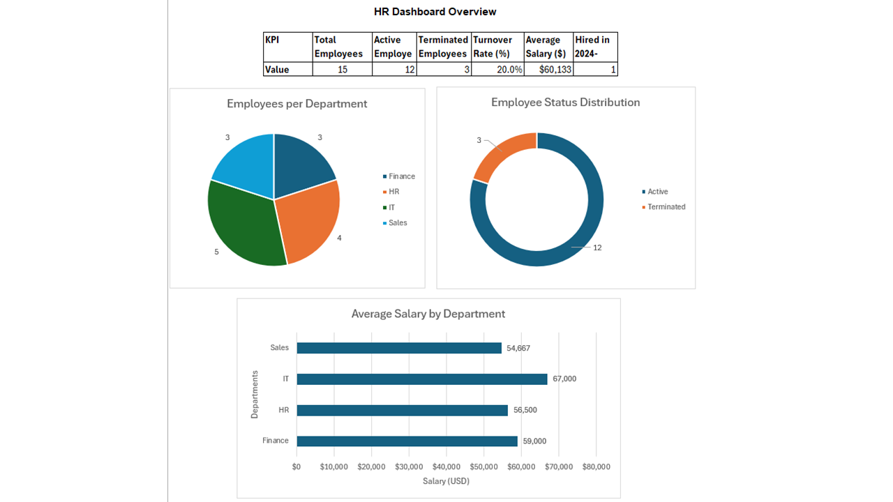

# 📊 HR Data Analysis Dashboard Project

This project explores employee data using MySQL and Excel.  
It simulates a small HR system and provides insights into staffing, salary, and department-level metrics.  
The final dashboard includes KPIs and charts to visualize key HR indicators.

---

## 🎯 Objectives

- Create and query an employee database in SQL
- Calculate HR metrics: active/terminated employees, turnover rate, average salary
- Visualize results with an interactive Excel dashboard
- Build a clean GitHub project to showcase skills

---

## 🛠 Tools Used

- **MySQL Workbench** – for table creation and SQL queries
- **Microsoft Excel** – for pivot tables, charts, and dashboard design
- **PowerPoint** – to export the dashboard to PNG

---

## 🗂 Project Files

- `HR_data_project.sql` — SQL: schema + queries for HR analysis  
- `HR_employees_data.xlsx` — Excel file with HR data, pivot tables, and charts  
- `HR_dashboard.png` — Final dashboard (KPI + charts preview)  
- `README.md` — This file

---

## 🖼️ Dashboard Preview



---

## 📊 Dashboard Overview

### 🔢 KPI Metrics:
- Total Employees: **15**
- Active Employees: **12**
- Terminated Employees: **3**
- Turnover Rate: **20%**
- Average Salary: **$60,133**
- Hired in 2024–2025: **1**

### 📈 Charts:
- Pie Chart → Employees per Department  
- Bar Chart → Average Salary by Department  
- Doughnut Chart → Employee Status Distribution

---

## 💻 Example SQL Queries

```sql
-- Count employees by department
SELECT Department, COUNT(*) AS TotalEmployees
FROM Employees
GROUP BY Department;

-- Average salary per department
SELECT Department, AVG(Salary) AS AvgSalary
FROM Employees
GROUP BY Department;

-- Active employees
SELECT * FROM Employees
WHERE TerminationDate IS NULL;

-- Turnover rate
SELECT
  (SELECT COUNT(*) FROM Employees WHERE TerminationDate IS NOT NULL) * 100.0 / COUNT(*) AS TurnoverRate
FROM Employees;
```

---

## 🧠 Skills Practiced

- Writing SQL queries with `GROUP BY`, `AVG()`, `COUNT()`, and subqueries
- Cleaning and exporting data from MySQL to Excel
- Building dashboards with pivot charts and KPI blocks
- Presenting HR metrics visually

---

## 🎓 What I Learned

This project helped me understand HR analytics in practice.  
I learned how to query employee databases, calculate key indicators like turnover and salary averages, and visualize the results in a professional dashboard.

